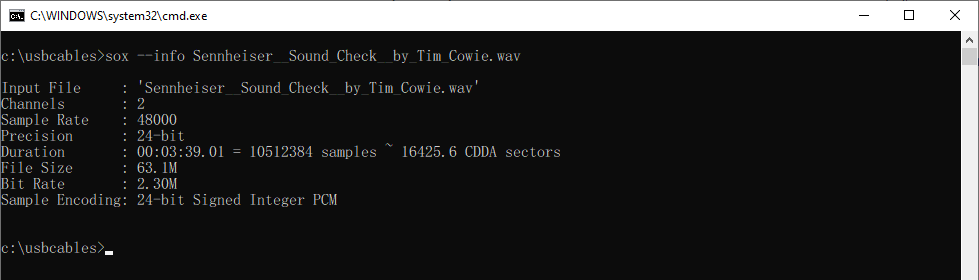
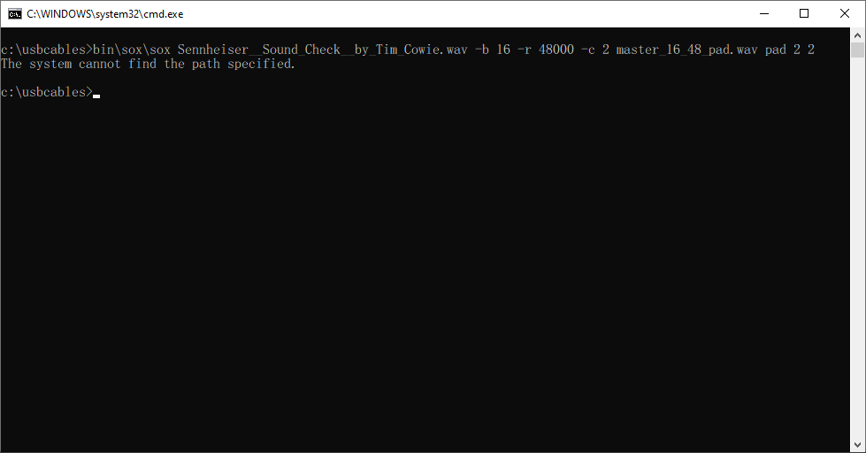
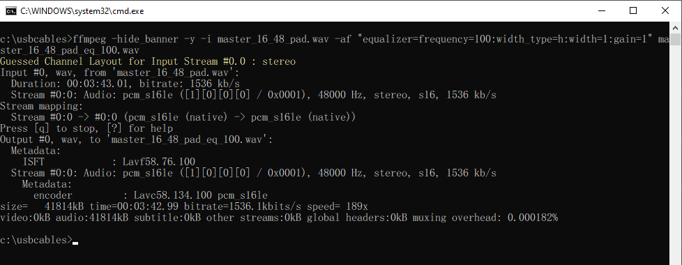
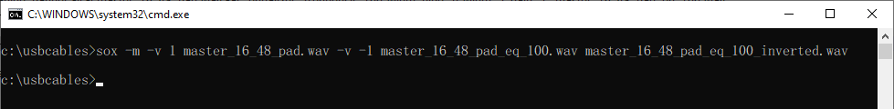
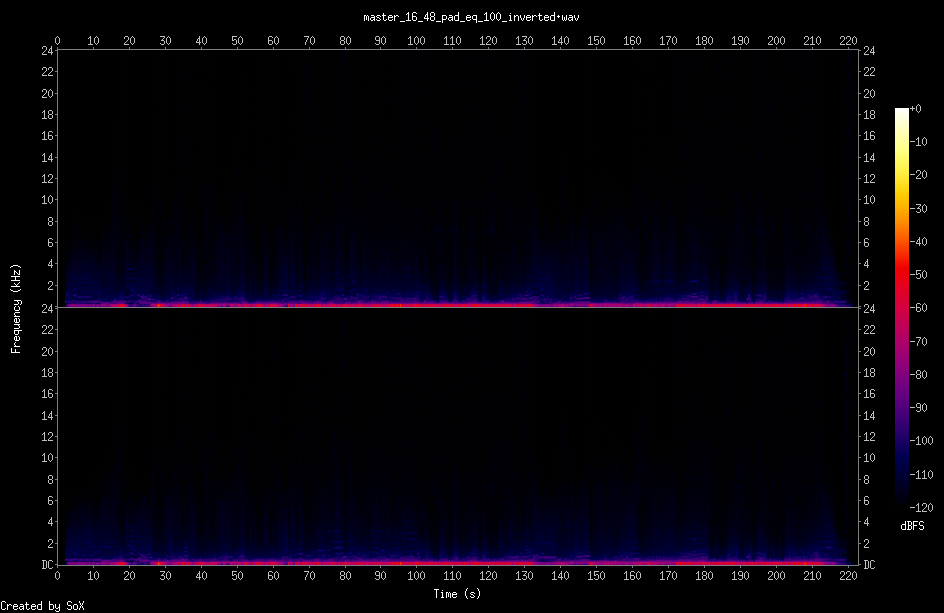

# USB-Digital-Audio-Cables-Testing (Draft 2021.10.23)

- [วัตถุประสงค์](#วัตถุประสงค์)
- [ความรู้เบื้องต้นเกี่ยวกับ USB Digital Audio](#ความรู้เบื้องต้นเกี่ยวกับ-usb-digital-audio)
- [การเลือกความเร็วสาย USB ให้เหมาะสมกับอุปกรณ์ USB](#การเลือกความเร็วสาย-usb-ให้เหมาะสมกับอุปกรณ์-usb)
- [สาย USB มีผลต่อเสียงที่ได้หรือไม่](#สาย-usb-มีผลต่อเสียงที่ได้หรือไม่-)
    - [อุปกรณ์ที่ใช้ทดสอบ](#อุปกรณ์ที่ใช้ทดสอบ)
    - [สาย USB ที่ใช้ทดสอบ](#สาย-usb-ที่ใช้ทดสอบ)
    - [โปรแกรมที่ใช้ทดสอบ](#โปรแกรมที่ใช้ทดสอบ)
    - [เพลงที่ใช้ทดสอบ](#เพลงที่ใช้ทดสอบ)
    - [วิธีการทดสอบ](#วิธีการทดสอบ)
    - [การเตรียมสภาพแวดล้อมเพื่อการทดลอง (Test Environment Setup)](#การเตรียมสภาพแวดล้อมเพื่อการทดลอง-test-environment-setup)
    - [Proof of Concept](#proof-of-concept)
- [ผลการทดสอบ](#ผลการทดสอบ)
- [สรุปผลการทดสอบ](#สรุปผลการทดสอบ)

## วัตถุประสงค์

- อธิบายถึงหลักการทำงานของ USB Digital Audio เบื้องต้น โดยพยายามใข้การอธิบายที่เข้าใจง่าย แต่อาจไม่ได้ลงลึกในเชิงเทคนิคมากนัก
- ทดลองทางวิทยาศาสตร์ว่าสาย USB มีผลต่อเสียงหรือไม่ โดยทำการทดลองในรูปแบบวิทยาศาสตร์ที่ทุกท่านสามารถทำตามได้ เน้นการอธิบายวิธีการทดลองในทุกขั้นตอน และตรวจสอบการทดลองดัวยข้อมูลที่เป็นตัวอักษรและตัวเลขเท่านั้น ไม่ใช้ตรวจสอบข้อมูลด้วยการใข้สายตาหรือการใช้หูฟังเสียง

## ความรู้เบื้องต้นเกี่ยวกับ USB Digital Audio

USB Digital Audio คือการส่งสัญญาณเพลงผ่านสาย USB จากอุปกรณ์ต้นทาง เช่น คอมพิวเตอร์, โทรศัพท์มือถือ ไปยังอุปกรณ์ปลายทาง เช่น DAC (Digital to Analog Converter), DDC (Digital to Digital Converter) เป็นต้น โดยมาตรฐาน USB จะรองรับรูปแบบการส่งข้อมูลดังนี้

|รูปแบบ|การใช้งานทั่วไป|ข้อดี|ข้อเสีย|การตรวจสอบข้อมูล|
|-|-|-|-|-|
|Interrupt|การสื่อสารระยะสั้น ๆ แต่เปลี่ยนแปลงข้อมูลบ่อย ๆ เช่น คีย์บอร์ด, เมาส์, จอยสติก เป็นต้น|ความน่าเชื่อถือสูง, เวลาตอบสนองคงที่|แบนด์วิธต่ำ|:heavy_check_mark:|
|Bulk|การถ่ายโอนข้อมูล เช่น การคัดลอกไฟล์ เป็นต้น|รับประกันความถูกต้องของข้อมูล|ไม่รับประกันแบนด์วิธ|:heavy_check_mark:|
|Isochronous|การส่งข้อมูลแบบเรียลไทม์ เช่น การสตรีมข้อมูลภาพ, เสียง เป็นต้น|รับประกันแบนด์วิธ|ไม่รับประกันความถูกต้องของข้อมูล|:x:|

สำหรับ USB Digital Audio เป็นการส่งข้อมูลเสียงแบบเรียลไทม์ จะใช้การส่งข้อมูลแบบ Isochronous ซึ่งจะเป็นการส่งข้อมูลที่
- **ไม่รับประกันความถูกต้องของข้อมูล** ข้อมูลอาจสูญหายแต่ยอมรับได้
- **เวลาในการตอบสนองจำกัด** ต้องได้รับข้อมูลภายในเวลาที่จำกัดมาก
- **รับส่งข้อมูลทางเดียว** ปลายทางไม่ต้องตอบรับการรับรส่งข้อมูลไปยังต้นทาง
- **รับประกันแบนด์วิธการส่งข้อมูล** จะไม่มีการลดแบนด์วิธการส่งข้อมูลลง

จะเห็นได้ว่าการส่งข้อมูลแบบ Isochronous เป็นการส่งข้อมูลแบบเรียลไทม์ ข้อมูลจะต้องส่งภายในเวลาที่จำกัด มีระยะเวลาในการส่งข้อมูลที่แน่นอน จึงต้องรับประกันแบนด์วิธการส่งข้อมูลให้เพียงพอต่อการใช้งานเพื่อให้ข้อมูลจากต้นทางไปถึงปลายทางในเวลาที่กำหนด ซึ่งหากข้อมูลสญหายไประหว่างทางจะไม่มีการส่งข้อมูลใหม่ (ภาพหรือเสียงอาจเสียหาย, เสียงอาจเงียบไป) เนื่องจากเป็นการรับส่งข้อมูลทางเดียว และหากยอมให้มีการส่งข้อมูลใหม่ก็จะเป็นการส่งข้อมูลไม่ตรงกับเวลาจริง เช่น ข้อมูลวินาทีที่ 10 เสียหาย หากเกิดการส่งข้อมูลใหม่ข้อมูลวินาทีที 10 เมื่อไปถึงปลายทางก็จะใม่ใช่ข้อมูลวินาที่ที่ 10 แล้ว เพราะเวลานั้นได้ผ่านไปแล้ว (อาจเป็นวินาทีที่ 12 เป็นต้น) ซึ่งข้อมูลที่ส่งไปใหม่ก็จะไปชนกับข้อมูลเวลาอื่น ๆ แทน

ส่วนการรับส่งข้อมูลแบบ Bulk เช่น การคัดลอกไฟล์ ไม่ได้เป็นการส่งข้อมูลแบบเรียลไทม์ จะรับประกันความถูกต้องของข้อมูลแต่ไม่รับประกันแบนด์วิธ ทำให้การคัดลอกไฟล์แต่ละครั้งจึงอาจใช้เวลาแตกต่างกันได้

การส่งข้อมูลแบบ Isochronous จะมีรูปแบบการส่งย่อยอีก 3 แบบ (ในการทดลองนี้จะไม่ได้ลงรายละเอียดข้อมูลในแต่ละแบบ) ได้แก่
- Asynchronous
- Synchronous
- Adaptive

## การเลือกความเร็วสาย USB ให้เหมาะสมกับอุปกรณ์ USB

ในการเลือกใช้สาย USB ควรเลือกใช้สายให้เหมาะสมกับความเร็วของอุปกรณ์ USB นั้น ๆ โดยเราสามารถตรวจสอบความเร็วของอุปกรณ์ USB ได้ด้วยโปรแกรม [Thesycon USB Descriptor Dumper](https://www.thesycon.de/eng/usb_descriptordumper.shtml)

จากการตรวจสอบ Shanling UA2 พบว่าความเร็วสูงสุดคือ USB 2.0 HighSpeed การเลือกใช้สาย USB 2.0 จึงเพียงพอต่อการใช้งานแล้ว การเลือกใช้สาย USB 3.0 ที่มีความเร็วมากกว่าอุปกรณ์ USB รองรับจึงไม่ได้ทำให้รับส่งข้อมูลเร็วขึ้นแต่อย่างใด

## USB Audio Class (UAC)

## สาย USB มีผลต่อเสียงที่ได้หรือไม่ ?

### อุปกรณ์ที่ใช้ทดสอบ

- **USB to S/PDIF Digital to Digital Converter:** [SIGNSTEK Q5 USB DDC/DAC](https://www.amazon.co.jp/-/en/dp/B00X9TY8ZW/) UAC 1.0 16bit/48kHz, ชิป [Burr-Brown PCM2407](https://www.ti.com/product/PCM2704)
- **S/PDIF to USB Digital to Digital Converter:** [Hifime UR23 SPDIF Optical to USB Converter](https://hifimediy.com/product/hifime-ur23-spdif-optical-to-usb-converter/) UAC 1.0 24bit/96kHz, ชิป [Savitech SA9023](https://www.savitech.co/usb-products)
- **USB Cable Tester:** [BitTradeOne USB CABLE CHECKER 2](https://bit-trade-one.co.jp/adusbcim/)
- **USB C Female to A Male Adapter:** [Mcdodo OT-697](https://www.mcdodolife.com/products/ot-697-full-compatibility-type-c-5a-to-usb-a-2.0-c.html)
- **USB C Female to B Male Adapter:** [UGREEN 20120](https://ugreenvietnam.com/ugreen-20120-usb-2-0-duc-may-in-ra-dau-cai-type-c-vo-nhom-mau-xam-us382-20020120.html)
- **TOSLINK Cable:** [UGREEN 70890](https://www.ugreen.com/products/fiber-optical-audio-cable) สายยาว 100 เซนติเมตร

### สาย USB ที่ใช้ทดสอบ

แบ่งกลุ่มสาย USB ออกเป็น 3 กลุ่ม กลุ่มละ 5 เส้น รวมเป็นสาย USB ทั้งหมด 15 เส้น ได้แก่
- กลุ่มสาย USB C แบบสั้น ความยาวน้อยกว่าหรือเท่ากับ 20 เซนติเมตร
- กลุ่มสาย USB C ทั่วไป ความยาวมากกว่า 20 เซนติเมตร
- กลุ่มสาย USB B ทุกความยาว

####  กลุ่มสาย USB C แบบสั้น ความยาวน้อยกว่าหรือเท่ากับ 20 เซนติเมตร

|ยี่ห้อ|รุ่น|ประภทหัวต่อ|ความเร็วสาย|ความยาวสาย (ซม.)|USB-IF Certified|
|-|-|-|-|-|-|
|Shanling|[สายแถมจาก UA2](https://en.shanling.com/product/396)|C to C|USB 2.0|10|-|
|ddHifi|[TC05 1st Gen.](https://www.ddhifi.com/productinfo/469679.html)|C to C|USB 2.0|10|-|
|FiiO|[LT-TC1](https://www.fiio.com/productinfo/354074.html)|C to C|USB 2.0|12|-|
|OE Audio|[OTG Digital Cable](https://www.oeaudio.net/oeotg)|C to C|USB 2.0|12|-|
|AENZR|[FPC AZ1301](http://www.aenzr.com/pd.jsp?id=31)|C to C|USB 3.1 Gen 2|13|-|

#### กลุ่มสาย USB C ทั่วไป ความยาวมากกว่า 20 เซนติเมตร

|ยี่ห้อ|รุ่น|ประภทหัวต่อ|ความเร็วสาย|ความยาวสาย (ซม.)|USB-IF Certified|
|-|-|-|-|-|-|
|UGREEN|[50996](https://www.ugreen.com.ph/products/usb-c-to-usb-c-cable?variant=16295877935153)|C to C|USB 2.0|50|-|
|ANKER|[PowerLine II A8485](https://www.anker.com/es/products/A8485011)|C to C|USB 3.1 Gen 2|90|[:heavy_check_mark:](https://www.usb.org/single-product/3563)|
|Verbatim|[65684](https://www.verbatim.com.hk/accessories/mobile-accessories/sync-charge-cables/usb3-2-c-to-c-cable.html)|C to C|USB 3.2|100|-|
|RØDE|[SC17](https://www.rode.com/accessories/cables/sc17)|C to C|USB 2.0|150|[:heavy_check_mark:](https://www.usb.org/single-product/3751)|
|KUULAA|[KL-X31](http://www.kuulaa.cn/plus/view.php?aid=45)|C to C|USB 2.0|300|-|

#### กลุ่มสาย USB B ทุกความยาว

|ยี่ห้อ|รุ่น|ประภทหัวต่อ|ความเร็วสาย|ความยาวสาย (ซม.)|USB-IF Certified|
|-|-|-|-|-|-|
|NO NAME|BLUE|A to B|USB 2.0|30|-|
|Audioquest|[Forest](https://www.audioquest.com/cables/digital-cables/usb-a-to-usb-b/forest)|A to B|USB 2.0|75|-|
|NEO by OYAIDE|[d+ USB class B](https://www.neo-w.com/english/d_plus/d_plus_usb_ser/)|A to B|USB 2.0|100|-|
|UGREEN|[80805](https://www.ugreen.com/products/usb-c-to-usb-b-2-0-printer-cable)|C to B|USB 2.0|100|-|
|UGREEN|[10350](https://www.ugreen.com/products/usb-2-0-printer-scanner-cable)|A to B|USB 2.0|150|-|

### โปรแกรมที่ใช้ทดสอบ

|โปรแกรม|เวอร์ชัน|การใช้งาน|
|-|-|-|
|[SoX](http://sox.sourceforge.net/)|[14.4.2](https://sourceforge.net/projects/sox/files/sox/14.4.2/)|แปลงไฟล์เสียง, ตัดไฟล์เสียง, สร้างไฟล์รูปภาพ spectrogram|
|[fmedia](https://stsaz.github.io/fmedia/)|[1.24](https://github.com/stsaz/fmedia/releases/tag/v1.24)|เล่นเพลง, บันทึกเสียงเพลง|
|[Pratt](https://www.fon.hum.uva.nl/praat/)|[6.1.53](https://www.fon.hum.uva.nl/praat/download_win.html)|ตรวจหา offset ของไฟล์เสียง|
|[FFmpeg](https://www.ffmpeg.org/)|[4.4](https://www.gyan.dev/ffmpeg/builds/)|สร้างไฟล์รูปภาพ waveform|
|[DeltaWave](https://deltaw.org/)|[v2.0.1](https://deltaw.org/)|ตรวจสอบความแตกต่างของไฟล์เสียง|

### เพลงที่ใช้ทดสอบ
- [Sennheiser 'Sound Check' by Tim Cowie](https://en-us.sennheiser.com/hearthedifference) โดยใช้ไฟล์จาก https://assets.sennheiser.com/global-downloads/file/13888/Sennheiser__Sound_Check__by_Tim_Cowie.wav

### วิธีการทดสอบ

Notebook ==> **USB Cable** ==> SIGNSTEK Q5 ==> UGREEN TOSLINK Cable ==> Hifime UR23 ==> Notebook

### การเตรียมสภาพแวดล้อมเพื่อการทดลอง (Test Environment Setup)

- เครื่อง Notebook ใช้ไฟจากแบตเตอรี่ ไม่เสียบสายไฟ เพื่อป้องกันปัญหา ground loop
- เปิด Airplane mode เพื่อป้องกันไม่ให้ Windows Update ทำงานเบื้องหลังซึ่งอาจกระทบการอ่าน-เขียนไฟล์ได้
- ปิดเสียงของ Windows โดยปรับให้เสียงอยู่ที่ 0 เนื่องจากโดยปกติสัญญาณเสียงที่ออกมาจาก USB DDC ทางช่อง Optical Out จะไม่ขึ้นอยู้กับระดับเสียงของ Windows แต่กับ USB DDC บางตัวเมื่อปรับเสียงให้ดังขึ้น ตัวเครื่องเองก็ปรับระดับสัญญาณของ Optical Out ให้สูงขึ้นด้วย ทำให้เสียงที่ได้ไม่เหมือนกับต้นฉบับและอาจเกิดการ clip ของเสียงได้
- ปรับ bit depth และ sample rate ให้ตรงกันทั้งระบบ ตั้งแต่ไฟล์ต้นฉบับ, USB DDC และ S/PDIF to USB หากไฟล์ต้นฉบับที่ใช้ในการทดสอบมี  bit depth หรือ sample rate ที่สูงกว่าระบบที่ใช้ทดสอบ ให้ทำการแปลงไฟล์ก่อนทำการทดสอบ
- เพิ่มเสียงว่าง (silence pad) เข้าไปที่ไฟล์ต้นฉบับ ทางด้านหัวและท้ายด้านละ 2 วินาที เนื่องจากเมื่อกดเล่นเพลงเสียงในช่วงเริ่มต้นอาจจะกระตุกจากการที่โปรแกรมเล่นเพลงกำลังทำการ buffer ไฟล์ ซึ่งจะทำให้ผลการทดลองคลาดเคลื่อน

#### การปรับตั้งค่าในส่วน Playback (USB to S/PDIF)

1. Double click ที่ SIGNSTEK Q5

    

2. ปรับเสียง Speakers ให้อยู่ที่ 0

    

3. ปิด Enhancements ทั้งหมด

    

4. ปรับ Default Format ให้อยู่ที่ 16 bit, 48000 Hz สูงสุดที่ SIGNSTEK Q5 รองรับ

    

5. ปิด Spartial sound

    

#### การปรับตั้งค่าในส่วนของ Recording (S/PDIF to USB)

1. Double click ที่ Hifime UR23

    

2. ปรับเสียง SPDIF interface ให้อยู่ที่ 100

    

3. ปรับ Default Format ให้อยู่ที่ 2 channel, 16 bit, 48000 Hz สูงสุดที่ SIGNSTEK Q5 รองรับ

    

#### การตรวจสอบ bit depth และ sample rate ไฟล์ต้นฉบับ

sox --info Sennheiser__Sound_Check__by_Tim_Cowie.wav

#### การแปลง bit depth และ sample rate ไฟล์ต้นฉบับ

sox Sennheiser__Sound_Check__by_Tim_Cowie.wav -b 16 -r 48000 -c 2 master_16_48_pad.wav pad 2 2

### Proof of Concept

ทดลองปรับ equalizer โดยลองปรับความถี่่ 100 Hz ขึ้นไป 1 dB

ffmpeg -hide_banner -y -i master_16_48_pad.wav -af "equalizer=frequency=100:width_type=h:width=1:gain=1" master_16_48_pad_eq_100.wav

จากนั้นลองกลับเฟสเทียบกับไฟล์ต้นฉบับ

sox -m -v 1 master_16_48_pad.wav -v -1 master_16_48_pad_eq_100.wav master_16_48_pad_eq_100_inverted.wav

เมื่อตรวจสอบไฟล์ที่กลับเฟสด้วยภาพ spectrogram จะพบว่าไฟล์ไม่ได้เงียบสนิท

sox master_16_48_pad_eq_100_inverted.wav -n spectrogram -t master_16_48_pad_eq_100_inverted.wav -o master_16_48_pad_eq_100_inverted.png

### ผลการทดสอบ

|ไฟล์เสียงที่ปรับ offset แล้ว|เปรียบเทียบ Bit Perfect กับต้นฉบับ|Spectrogram กลับเฟส|
|-|-|-|
|[AENZR FPC AZ1301](recorded_trim/AENZR_AZ1301_C-C_USB31_13cm.wav)|[100%](result_deltawave/AENZR_AZ1301_C-C_USB31_13cm.txt)|[Spectrogram](visual_spectrogram/AENZR_AZ1301_C-C_USB31_13cm_inverted.png)|
|[ANKER PowerLine II A8485](recorded_trim/ANKER_A8485_C-C_USB31_90cm.wav)|[100%](result_deltawave/ANKER_A8485_C-C_USB31_90cm.txt)|[Spectrogram](visual_spectrogram/ANKER_A8485_C-C_USB31_90cm_inverted.png)|
|[Audioquest Forest](recorded_trim/Audioquest_Forest_A-B_75cm.wav)|[100%](result_deltawave/Audioquest_Forest_A-B_75cm.txt)|[Spectrogram](visual_spectrogram/Audioquest_Forest_A-B_75cm_inverted.png)|
|[ddHifi TC05 1st Gen.](recorded_trim/ddHifi_TC05_C-C_USB20_15cm.wav)|[100%](result_deltawave/ddHifi_TC05_C-C_USB20_15cm.txt)|[Spectrogram](visual_spectrogram/ddHifi_TC05_C-C_USB20_15cm_inverted.png)|
|[FiiO LT-TC1](recorded_trim/FiiO_LT-TC01_C-C_USB20_15cm.wav)|[100%](result_deltawave/FiiO_LT-TC01_C-C_USB20_15cm.txt)|[Spectrogram](visual_spectrogram/FiiO_LT-TC01_C-C_USB20_15cm_inverted.png)|
|[NEO (created by OYAIDE Elec.) d+ USB class B](recorded_trim/NEO_d%2B_A-B_USB20_100cm.wav)|[100%](result_deltawave/NEO_d%2B_A-B_USB20_100cm.txt)|[Spectrogram](visual_spectrogram/NEO_d%2B_A-B_USB20_100cm_inverted.png)|
|[OE Audio OTG Digital Cable](recorded_trim/OEAudio_OTG_C-C_USB20_12cm.wav)|[100%](result_deltawave/OEAudio_OTG_C-C_USB20_12cm.txt)|[Spectrogram](visual_spectrogram/OEAudio_OTG_C-C_USB20_12cm_inverted.png)|
|[RØDE SC17](recorded_trim/RODE_SC17_C-C_USB20_100cm.wav)|[100%](result_deltawave/RODE_SC17_C-C_USB20_100cm.txt)|[Spectrogram](visual_spectrogram/RODE_SC17_C-C_USB20_100cm_inverted.png)|
|[Shanling UA2 สายแถม](recorded_trim/Shanling_UA2_C-C_USB2.0_10cm.wav)|[100%](result_deltawave/Shanling_UA2_C-C_USB2.0_10cm.txt)|[Spectrogram](visual_spectrogram/Shanling_UA2_C-C_USB2.0_10cm_inverted.png)|
|[UGREEN 10350](recorded_trim/UGREEN_10350_A-B_USB20_150cm.wav)|[100%](result_deltawave/UGREEN_10350_A-B_USB20_150cm.txt)|[Spectrogram](visual_spectrogram/UGREEN_10350_A-B_USB20_150cm_inverted.png)|
|[UGREEN 50996](recorded_trim/UGREEN_50996_C-C_USB20_50cm.wav)|[100%](result_deltawave/UGREEN_50996_C-C_USB20_50cm.txt)|[Spectrogram](visual_spectrogram/UGREEN_50996_C-C_USB20_50cm_inverted.png)|

### สรุปผลการทดสอบ

สาย USB ทุกเส้นให้เสียงที่เหมือนกับต้นฉบับ 100% ไม่ว่าจะเปลี่ยนไปใช้สายเส้นไหนก็ตาม แสดงว่าสาย USB ไม่มีผลต่อเสียงที่ได้แต่อย่างใด
