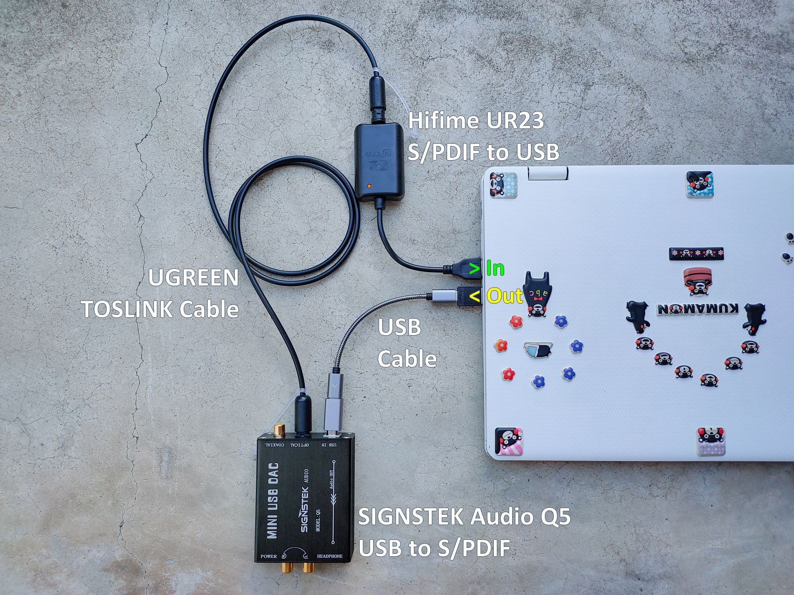

# USB-Digital-Audio-Cables-Testing (Draft 2021.10.16)

## ความรู้เบื้องต้นเกี่ยวกับ USB Digital Audio

- อ้างอิง Google [USB Digital Audio ](https://source.android.com/devices/audio/usb)
- Cambridge Audio [Our Guide to USB Audio - Why Should I Use it?](https://www.cambridgeaudio.com/usa/en/blog/our-guide-usb-audio-why-should-i-use-it/)
- EDN [Fundamentals of USB Audio](https://www.edn.com/fundamentals-of-usb-audio/)
- Intona [Cable](https://intona.eu/en/stories/cable)

## USB 1.0, 2.0, 3.0 ...

สามารถตรวจสอบความเร็วของ USB DAC ด้วยโปรแกรม [Thesycon USB Descriptor Dumper](https://www.thesycon.de/eng/usb_descriptordumper.shtml) บน Windows OS

จากการตรวจสอบ Shanling UA2 พบว่าใช้ USB 2.0 HighSpeed การเลือกใช้สาย USB 2.0 จึงเพียงพอต่อการใช้งาน การใช้สาย USB 3.0 จึงไม่ได้ทำให้รับ-ส่งข้อมูลเร็วขึ้นแต่อย่างใด

## USB Audio Class (UAC)

## สาย USB มีผลต่อเสียงที่ได้หรือไม่ ?

### อุปกรณ์ที่ใช้ทดสอบ

- **USB to S/PDIF Digital to Digital Converter:** [SIGNSTEK Q5 USB DDC/DAC](https://www.amazon.co.jp/-/en/dp/B00X9TY8ZW/) UAC X.0 24bit/96kHz, ชิป [TI/Burr-Brown PCM2407](https://www.ti.com/product/PCM2704)
- **S/PDIF to USB Digital to Digital Converter:** [Hifime UR23 SPDIF Optical to USB Converter](https://hifimediy.com/product/hifime-ur23-spdif-optical-to-usb-converter/) UAC 1.0 24bit/96kHz, ชิป [Savitech SA9023](https://www.savitech.co/usb-products)
- **USB Cable Tester:** [BitTradeOne USB CABLE CHECKER 2](https://bit-trade-one.co.jp/adusbcim/)
- **USB C Female to A Male Adapter:** [Mcdodo OT-697](https://www.mcdodolife.com/products/ot-697-full-compatibility-type-c-5a-to-usb-a-2.0-c.html)
- **USB C Female to B Male Adapter:** [UGREEN 20120](https://ugreenvietnam.com/ugreen-20120-usb-2-0-duc-may-in-ra-dau-cai-type-c-vo-nhom-mau-xam-us382-20020120.html)
- **TOSLINK Cable:** [UGREEN 70890](https://www.ugreen.com/products/fiber-optical-audio-cable) สายยาว 100 เซนติเมตร

### สาย USB ที่ใช้ทดสอบ
- [AENZR FPC AZ1301, USB C Male to C Male, USB 3.1 Gen 2](http://www.aenzr.com/pd.jsp?id=31) สายยาว 13 เซนติเมตร
- [ANKER PowerLine II A8485, USB C Male to C Male, USB 3.1 Gen 2](https://www.anker.com/es/products/A8485011) ได้รับมาตรฐาน [USB-IF Certified](https://www.usb.org/single-product/3563) สายยาว 90 เซนติเมตร
- [ddHifi TC05 1st Gen. USB C Male to C Male, USB 2.0](https://www.ddhifi.com/productinfo/469679.html) สายยาว 10 เซนติเมตร
- [FiiO LT-TC1, USB C Male to C Male USB 2.0](https://www.fiio.com/productinfo/354074.html) สายยาว 12 เซนติเมตร
- [NEO (created by OYAIDE Elec.) d+ USB class B, USB A Male to B Male , USB 2.0](https://www.neo-w.com/english/d_plus/d_plus_usb_ser/) สายยาว 100 เซนติเมตร
- [OE Audio OTG Digital Cable, USB C Male to C Male, USB 2.0](https://www.oeaudio.net/oeotg) สายยาว 12 เซนติเมตร
- [RØDE SC17, USB C Male to C Male, USB 2.0](https://www.rode.com/accessories/cables/sc17) ได้รับมาตรฐาน [USB-IF Certified](https://www.usb.org/single-product/3751) สายยาว 150 เซนติเมตร
- [Shanling UA2 สายแถม, USB C Male to C Male, USB 2.0](https://en.shanling.com/product/396) สายยาว 120 เซนติเมตร
- [UGREEN 10350, USB A Male to B Male USB 2.0](https://www.ugreen.com/products/usb-2-0-printer-scanner-cable) สายยาว 150 เซนติเมตร
- [UGREEN 50996, USB C Male to C Male, USB 2.0](https://www.ugreen.com.ph/products/usb-c-to-usb-c-cable?variant=16295877935153) สายยาว 50 เซนติเมตร

### โปรแกรมที่ใช้ทดสอบ
- [FFmpeg v4.4](https://www.ffmpeg.org/)
- [fmedia v1.24](https://stsaz.github.io/fmedia/)
- [Pratt v6.1.53](https://www.fon.hum.uva.nl/praat/)
- [SoX v14.4.2](http://sox.sourceforge.net/)
- [DeltaWave v2.0.1](https://deltaw.org/)

### เพลงที่ใช้ทดสอบ
- [Sennheiser 'Sound Check' by Tim Cowie](https://en-us.sennheiser.com/hearthedifference)

### วิธีการทดสอบ

PC ==> **USB Cable** ==> SIGNSTEK Q5 ==> UGREEN TOSLINK Cable ==> Hifime UR23 ==> PC

### สรุปผลการทดสอบ
|ไฟล์เสียงจากสาย USB|เปรียบเทียบ Bit Perfect กับต้นฉบับ|MD5|
|---|---|---|
|[AENZR FPC AZ1301](recorded_trim/AENZR_AZ1301_C-C_USB31_13cm.wav)|[100%](result_deltawave/AENZR_AZ1301_C-C_USB31_13cm.html)|[7d229a9bf0a3f73c4de0121a5460125b](result_hash/AENZR_AZ1301_C-C_USB31_13cm_md5.txt)|
|[ANKER PowerLine II A8485](recorded_trim/ANKER_A8485_C-C_USB31_90cm.wav)|[100%](result_deltawave/ANKER_A8485_C-C_USB31_90cm.html)|[7d229a9bf0a3f73c4de0121a5460125b](result_hash/ANKER_A8485_C-C_USB31_90cm_md5.txt)|
|[ddHifi TC05 1st Gen.](recorded_trim/ddHifi_TC05_C-C_USB20_15cm.wav)|[100%](result_deltawave/ddHifi_TC05_C-C_USB20_15cm.html)|[7d229a9bf0a3f73c4de0121a5460125b](result_hash/ddHifi_TC05_C-C_USB20_15cm_md5.txt)|
|[FiiO LT-TC1](recorded_trim/FiiO_LT-TC01_C-C_USB20_15cm.wav)|[100%](result_deltawave/FiiO_LT-TC01_C-C_USB20_15cm.html)|[7d229a9bf0a3f73c4de0121a5460125b](result_hash/FiiO_LT-TC01_C-C_USB20_15cm_md5.txt)|
|[NEO (created by OYAIDE Elec.) d+ USB class B](recorded_trim/NEO_d%2B_A-B_USB20_100cm.wav)|[100%](result_deltawave/NEO_d%2B_A-B_USB20_100cm.html)|[7d229a9bf0a3f73c4de0121a5460125b](result_hash/NEO_d%2B_A-B_USB20_100cm_md5.txt)|
|[OE Audio OTG Digital Cable](recorded_trim/OEAudio_OTG_C-C_USB20_12cm.wav)|[100%](result_deltawave/OEAudio_OTG_C-C_USB20_12cm.html)|[7d229a9bf0a3f73c4de0121a5460125b](result_hash/OEAudio_OTG_C-C_USB20_12cm_md5.txt)|
|[RØDE SC17](recorded_trim/RODE_SC17_C-C_USB20_100cm.wav)|[100%](result_deltawave/RODE_SC17_C-C_USB20_100cm.html)|[7d229a9bf0a3f73c4de0121a5460125b](result_hash/RODE_SC17_C-C_USB20_100cm_md5.txt)|
|[Shanling UA2 สายแถม](recorded_trim/Shanling_UA2_C-C_USB2.0_10cm.wav)|[100%](result_deltawave/Shanling_UA2_C-C_USB2.0_10cm.html)|[7d229a9bf0a3f73c4de0121a5460125b](result_hash/Shanling_UA2_C-C_USB2.0_10cm_md5.txt)|
|[UGREEN 10350](recorded_trim/UGREEN_10350_A-B_USB20_150cm.wav)|[100%](result_deltawave/UGREEN_10350_A-B_USB20_150cm.html)|[7d229a9bf0a3f73c4de0121a5460125b](result_hash/UGREEN_10350_A-B_USB20_150cm_md5.txt)|
|[UGREEN 50996](recorded_trim/UGREEN_50996_C-C_USB20_50cm.wav)|[100%](result_deltawave/UGREEN_50996_C-C_USB20_50cm.html)|[7d229a9bf0a3f73c4de0121a5460125b](result_hash/UGREEN_50996_C-C_USB20_50cm_md5.txt)|

