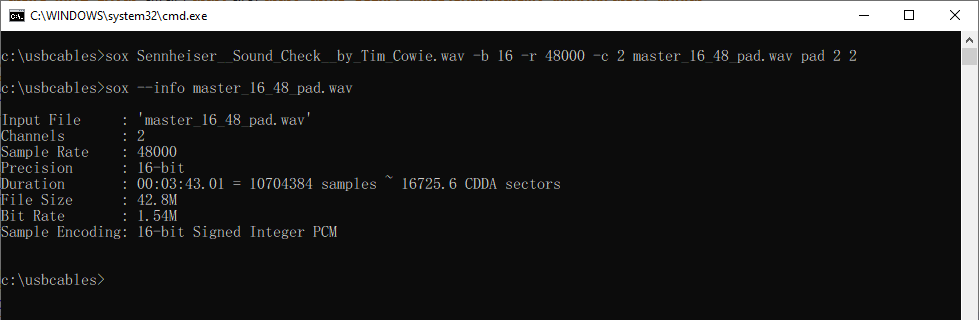

# USB-Digital-Audio-Cables-Testing (Draft 2021.10.23)

- [วัตถุประสงค์](#วัตถุประสงค์)
- [ความรู้เบื้องต้นเกี่ยวกับ USB Digital Audio](#ความรู้เบื้องต้นเกี่ยวกับ-usb-digital-audio)
- [การเลือกความเร็วสาย USB ให้เหมาะสมกับอุปกรณ์ USB](#การเลือกความเร็วสาย-usb-ให้เหมาะสมกับอุปกรณ์-usb)
- [การทดลอง สาย USB มีผลต่อเสียงที่ได้หรือไม่](#การทดลอง-สาย-usb-มีผลต่อเสียงที่ได้หรือไม่-)
    - [อุปกรณ์ที่ใช้ทดลอง](#อุปกรณ์ที่ใช้ทดลอง)
    - [สาย USB ที่ใช้ทดลอง](#สาย-usb-ที่ใช้ทดลอง)
    - [โปรแกรมที่ใช้ทดลอง](#โปรแกรมที่ใช้ทดลอง)
    - [เพลงที่ใช้ทดลอง](#เพลงที่ใช้ทดลอง)
    - [การเตรียมสภาพแวดล้อมเพื่อการทดลอง](#การเตรียมสภาพแวดล้อมเพื่อการทดลอง)
    - [การทดสอบความถูกต้องของวิธีการทดลอง](#การทดสอบความถูกต้องของวิธีการทดลอง)
    - [ผลการทดลอง](#ผลการทดลอง)
- [สรุปผลการทดลอง](#สรุปผลการทดลอง)

## วัตถุประสงค์

- อธิบายถึงหลักการทำงานของ USB Digital Audio เบื้องต้น โดยพยายามใข้การอธิบายที่เข้าใจง่าย แต่อาจไม่ได้ลงลึกในเชิงเทคนิคมากนัก
- ทดลองทางวิทยาศาสตร์ว่าสาย USB มีผลต่อเสียงหรือไม่ โดยทำการทดลองในรูปแบบวิทยาศาสตร์ที่ทุกท่านสามารถทำตามได้ เน้นการอธิบายวิธีการทดลองในทุกขั้นตอน และตรวจสอบการทดลองดัวยข้อมูลที่เป็นตัวอักษรและตัวเลขเท่านั้น ไม่ใช้ตรวจสอบข้อมูลด้วยการใข้สายตาหรือการใช้หูฟังเสียง

## ความรู้เบื้องต้นเกี่ยวกับ USB Digital Audio

USB Digital Audio คือการส่งสัญญาณเพลงผ่านสาย USB จากอุปกรณ์ต้นทาง เช่น คอมพิวเตอร์, โทรศัพท์มือถือ ไปยังอุปกรณ์ปลายทาง เช่น DAC (Digital to Analog Converter), DDC (Digital to Digital Converter) เป็นต้น โดยมาตรฐาน USB จะรองรับรูปแบบการส่งข้อมูลดังนี้

|รูปแบบ|การใช้งานทั่วไป|ข้อดี|ข้อเสีย|การตรวจสอบข้อมูล|
|-|-|-|-|-|
|Interrupt|การสื่อสารระยะสั้น ๆ แต่เปลี่ยนแปลงข้อมูลบ่อย ๆ เช่น คีย์บอร์ด, เมาส์, จอยสติก เป็นต้น|ความน่าเชื่อถือสูง, เวลาตอบสนองคงที่|แบนด์วิธต่ำ|:heavy_check_mark:|
|Bulk|การถ่ายโอนข้อมูล เช่น การคัดลอกไฟล์ เป็นต้น|รับประกันความถูกต้องของข้อมูล|ไม่รับประกันแบนด์วิธ|:heavy_check_mark:|
|Isochronous|การส่งข้อมูลแบบเรียลไทม์ เช่น การสตรีมข้อมูลภาพ, เสียง เป็นต้น|รับประกันแบนด์วิธ|ไม่รับประกันความถูกต้องของข้อมูล|:x:|

สำหรับ USB Digital Audio เป็นการส่งข้อมูลเสียงแบบเรียลไทม์ จะใช้การส่งข้อมูลแบบ Isochronous ซึ่งจะเป็นการส่งข้อมูลที่
- **ไม่รับประกันความถูกต้องของข้อมูล** ข้อมูลอาจสูญหายแต่ยอมรับได้
- **เวลาในการตอบสนองจำกัด** ต้องได้รับข้อมูลภายในเวลาที่จำกัดมาก
- **รับส่งข้อมูลทางเดียว** ปลายทางไม่ต้องตอบรับการรับรส่งข้อมูลไปยังต้นทาง
- **รับประกันแบนด์วิธการส่งข้อมูล** จะไม่มีการลดแบนด์วิธการส่งข้อมูลลง

จะเห็นได้ว่าการส่งข้อมูลแบบ Isochronous เป็นการส่งข้อมูลแบบเรียลไทม์ ข้อมูลจะต้องส่งภายในเวลาที่จำกัด มีระยะเวลาในการส่งข้อมูลที่แน่นอน จึงต้องรับประกันแบนด์วิธการส่งข้อมูลให้เพียงพอต่อการใช้งานเพื่อให้ข้อมูลจากต้นทางไปถึงปลายทางในเวลาที่กำหนด ซึ่งหากข้อมูลสญหายไประหว่างทางจะไม่มีการส่งข้อมูลใหม่ (ภาพหรือเสียงอาจเสียหาย, เสียงอาจเงียบไป) เนื่องจากเป็นการรับส่งข้อมูลทางเดียว และหากยอมให้มีการส่งข้อมูลใหม่ก็จะเป็นการส่งข้อมูลไม่ตรงกับเวลาจริง เช่น ข้อมูลวินาทีที่ 10 เสียหาย หากเกิดการส่งข้อมูลใหม่ข้อมูลวินาทีที 10 เมื่อไปถึงปลายทางก็จะใม่ใช่ข้อมูลวินาที่ที่ 10 แล้ว เพราะเวลานั้นได้ผ่านไปแล้ว (อาจเป็นวินาทีที่ 12 เป็นต้น) ซึ่งข้อมูลที่ส่งไปใหม่ก็จะไปชนกับข้อมูลเวลาอื่น ๆ แทน

ส่วนการรับส่งข้อมูลแบบ Bulk เช่น การคัดลอกไฟล์ ไม่ได้เป็นการส่งข้อมูลแบบเรียลไทม์ จะรับประกันความถูกต้องของข้อมูลแต่ไม่รับประกันแบนด์วิธ ทำให้การคัดลอกไฟล์แต่ละครั้งจึงอาจใช้เวลาแตกต่างกันได้

การส่งข้อมูลแบบ Isochronous จะมีรูปแบบการส่งย่อยอีก 3 แบบ (ในการทดลองนี้จะไม่ได้ลงรายละเอียดข้อมูลในแต่ละแบบ) ได้แก่
- Asynchronous
- Synchronous
- Adaptive

## การเลือกความเร็วสาย USB ให้เหมาะสมกับอุปกรณ์ USB

ในการเลือกใช้สาย USB ควรเลือกใช้สายให้เหมาะสมกับความเร็วของอุปกรณ์ USB นั้น ๆ โดยเราสามารถตรวจสอบความเร็วของอุปกรณ์ USB ได้ด้วยโปรแกรม [:link: Thesycon USB Descriptor Dumper](https://www.thesycon.de/eng/usb_descriptordumper.shtml)

จากการตรวจสอบ Shanling UA2 พบว่าความเร็วสูงสุดคือ USB 2.0 HighSpeed การเลือกใช้สาย USB 2.0 จึงเพียงพอต่อการใช้งานแล้ว การเลือกใช้สาย USB 3.0 ที่มีความเร็วมากกว่าอุปกรณ์ USB รองรับจึงไม่ได้ทำให้รับส่งข้อมูลเร็วขึ้นแต่อย่างใด

## การทดลอง สาย USB มีผลต่อเสียงที่ได้หรือไม่ ?

เป็นการทดลองทางวิทยาศาสตร์ว่าสาย USB มีผลต่อเสียงที่ได้หรือไม่ โดยทดสอบในระบบดิจิตัลทั้งหมดไม่มีการแปลงสัญญาณไปเป็นอนาล็อก และตรวจสอบการทดลองดัวยข้อมูลที่เป็นตัวอักษรและตัวเลขเท่านั้นไม่ใช้ตรวจสอบข้อมูลด้วยการใข้สายตาหรือการใช้หูฟังเสียงแต่อย่างใด
1. ส่งสัญญาณเสียงผ่านสาย USB ไปยัง USB DDC (Digital to Digital Converter)
2. ทำการแปลงสัญญาณจากสาย USB ไปเป็น S/PDIF แล้วส่งข้อมูลผ่านสาย TOSLINK
3. ใช้ USB DDC อีกตัวในการรับข้อมูล S/PDIF ที่มาจากสาย TOSLINK กลับมาเป็น USB
4. บันทึกเสียงที่ได้จาก USB กลับมาเป็นไฟล์ wave
5. ทำการปรับ offset ไฟล์ที่บันทึกเสียงให้ตรงกับต้นฉบับ
6. ทำการกลับเฟสไฟล์เสียงที่บันทึกกับไฟล์ต้นฉบับ
7. ตรวจสอบไฟล์ที่ได้กลับเฟสด้วยโปรแกรมว่ามีข้อมูลเหมือนกับต้นฉบับหรือไม่

:computer: Notebook ==> :musical_score: **USB Cable** ==> :arrow_forward: SIGNSTEK Q5 ==> :musical_score: UGREEN TOSLINK Cable ==> :arrow_forward: Hifime UR23 ==> :computer: Notebook

### โปรแกรมที่ใช้ทดลอง

|โปรแกรม|เวอร์ชัน|การใช้งาน|
|-|-|-|
|[:computer: SoX](http://sox.sourceforge.net/)|[:floppy_disk: 14.4.2](https://sourceforge.net/projects/sox/files/sox/14.4.2/)|แปลงไฟล์เสียง, ตัดไฟล์เสียง, สร้างไฟล์รูปภาพ spectrogram|
|[:computer: fmedia](https://stsaz.github.io/fmedia/)|[:floppy_disk: 1.24](https://github.com/stsaz/fmedia/releases/tag/v1.24)|เล่นเพลง, บันทึกเสียงเพลง|
|[:computer: Pratt](https://www.fon.hum.uva.nl/praat/)|[:floppy_disk: 6.1.53](https://www.fon.hum.uva.nl/praat/download_win.html)|ตรวจหา offset ของไฟล์เสียง|
|[:computer: FFmpeg](https://www.ffmpeg.org/)|[:floppy_disk: 4.4](https://www.gyan.dev/ffmpeg/builds/)|สร้างไฟล์รูปภาพ waveform|
|[:computer: DeltaWave](https://deltaw.org/)|[:floppy_disk: 2.0.1](https://deltaw.org/)|ตรวจสอบความแตกต่างของไฟล์เสียง|

### เพลงที่ใช้ทดลอง
- [:link: Sennheiser 'Sound Check' by Tim Cowie](https://en-us.sennheiser.com/hearthedifference) โดยใช้ไฟล์จาก [:musical_score: https://assets.sennheiser.com/global-downloads/file/13888/Sennheiser__Sound_Check__by_Tim_Cowie.wav](https://assets.sennheiser.com/global-downloads/file/13888/Sennheiser__Sound_Check__by_Tim_Cowie.wav)

### อุปกรณ์ที่ใช้ทดลอง

- **USB to S/PDIF Digital to Digital Converter:** [:link: SIGNSTEK Q5 USB DDC/DAC](https://www.amazon.co.jp/-/en/dp/B00X9TY8ZW/) UAC 1.0 16bit/48kHz, ชิป [:link: Burr-Brown PCM2407](https://www.ti.com/product/PCM2704)
- **S/PDIF to USB Digital to Digital Converter:** [:link: Hifime UR23 SPDIF Optical to USB Converter](https://hifimediy.com/product/hifime-ur23-spdif-optical-to-usb-converter/) UAC 1.0 24bit/96kHz, ชิป [:link: Savitech SA9023](https://www.savitech.co/usb-products)
- **USB C Female to A Male Adapter:** [:link: Mcdodo OT-697](https://www.mcdodolife.com/products/ot-697-full-compatibility-type-c-5a-to-usb-a-2.0-c.html)
- **USB C Female to B Male Adapter:** [:link: UGREEN 20120](https://ugreenvietnam.com/ugreen-20120-usb-2-0-duc-may-in-ra-dau-cai-type-c-vo-nhom-mau-xam-us382-20020120.html)
- **TOSLINK Cable:** [:link: UGREEN 70890](https://www.ugreen.com/products/fiber-optical-audio-cable) สายยาว 100 เซนติเมตร

### สาย USB ที่ใช้ทดลอง

แบ่งกลุ่มสาย USB ออกเป็น 3 กลุ่ม กลุ่มละ 5 เส้น รวมเป็นสาย USB ทั้งหมด 15 เส้น ได้แก่
- กลุ่มสาย USB C แบบสั้น ความยาวน้อยกว่าหรือเท่ากับ 20 เซนติเมตร
- กลุ่มสาย USB C ทั่วไป ความยาวมากกว่า 20 เซนติเมตร
- กลุ่มสาย USB B ทุกความยาว

####  กลุ่มสาย USB C แบบสั้น ความยาวน้อยกว่าหรือเท่ากับ 20 เซนติเมตร

|ยี่ห้อ|รุ่น|ประเภทหัวต่อ|ความเร็วสาย|ความยาวสาย (ซม.)|USB-IF Certified|รูปถ่าย|
|-|-|-|-|-|-|-|
|Shanling|[:link: สายแถมจาก UA2](https://en.shanling.com/product/396)|C to C|USB 2.0|10|-|[:camera:](pictures/Shanling_UA2_C-C_USB20_10cm.jpg)|
|ddHifi|[:link: TC05 1st Gen.](https://www.ddhifi.com/productinfo/469679.html)|C to C|USB 2.0|10|-|[:camera:](pictures/ddHifi_TC05_C-C_USB20_15cm.jpg)|
|FiiO|[:link: LT-TC1](https://www.fiio.com/productinfo/354074.html)|C to C|USB 2.0|12|-|[:camera:](pictures/FiiO_LT-TC01_C-C_USB20_15cm.jpg)|
|OE Audio|[:link: OTG Digital Cable](https://www.oeaudio.net/oeotg)|C to C|USB 2.0|12|-|[:camera:](pictures/OEAudio_OTG_C-C_USB20_12cm.jpg)|
|AENZR|[:link: FPC AZ1301](http://www.aenzr.com/pd.jsp?id=31)|C to C|USB 3.1 Gen 2|13|-|[:camera:](pictures/AENZR_AZ1301_C-C_USB31_13cm.jpg)|

#### กลุ่มสาย USB C ทั่วไป ความยาวมากกว่า 20 เซนติเมตร

|ยี่ห้อ|รุ่น|ประเภทหัวต่อ|ความเร็วสาย|ความยาวสาย (ซม.)|USB-IF Certified|รูปถ่าย|
|-|-|-|-|-|-|-|
|UGREEN|[:link: 50996](https://www.ugreen.com.ph/products/usb-c-to-usb-c-cable?variant=16295877935153)|C to C|USB 2.0|50|-|[:camera:](pictures/UGREEN_50996_C-C_USB20_50cm.jpg)|
|ANKER|[:link: A8485](https://www.anker.com/es/products/A8485011)|C to C|USB 3.1 Gen 2|90|[:heavy_check_mark:](https://www.usb.org/single-product/3563)|[:camera:](pictures/ANKER_A8485_C-C_USB31_90cm.jpg)|
|Verbatim|[:link: 65684](https://www.verbatim.com.hk/accessories/mobile-accessories/sync-charge-cables/usb3-2-c-to-c-cable.html)|C to C|USB 3.2|100|-|[:camera:](pictures/Verbatim_65684_C-C_USB32_100cm.jpg)|
|RØDE|[:link: SC17](https://www.rode.com/accessories/cables/sc17)|C to C|USB 2.0|150|[:heavy_check_mark:](https://www.usb.org/single-product/3751)|[:camera:](pictures/RODE_SC17_C-C_USB20_100cm.jpg)|
|KUULAA|[:link: KL-X31](http://www.kuulaa.cn/plus/view.php?aid=45)|C to C|USB 2.0|300|-|[:camera:](pictures/KUULAA_KL-X31_C-C_USB20_300cm.jpg)|

#### กลุ่มสาย USB B ทุกความยาว

|ยี่ห้อ|รุ่น|ประเภทหัวต่อ|ความเร็วสาย|ความยาวสาย (ซม.)|USB-IF Certified|รูปถ่าย|
|-|-|-|-|-|-|-|
|NONAME|BLUE|A to B|USB 2.0|30|-|[:camera:](pictures/NONAME_BLUE_A-B_USB20_30cm.jpg)|
|Audioquest|[:link: Forest](https://www.audioquest.com/cables/digital-cables/usb-a-to-usb-b/forest)|A to B|USB 2.0|75|-|[:camera:](pictures/Audioquest_Forest_A-B_USB20_75cm.jpg)|
|NEO by OYAIDE|[:link: d+ USB class B](https://www.neo-w.com/english/d_plus/d_plus_usb_ser/)|A to B|USB 2.0|100|-|[:camera:](pictures/NEO_d%2B_A-B_USB20_100cm.jpg)|
|UGREEN|[:link: 80805](https://www.ugreen.com/products/usb-c-to-usb-b-2-0-printer-cable)|C to B|USB 2.0|100|-|[:camera:](pictures/UGREEN_80805_C-B_USB20_100cm.jpg)|
|UGREEN|[:link: 10350](https://www.ugreen.com/products/usb-2-0-printer-scanner-cable)|A to B|USB 2.0|150|-|[:camera:](pictures/UGREEN_10350_A-B_USB20_150cm.jpg)|

### การเตรียมสภาพแวดล้อมเพื่อการทดลอง

- เครื่อง Notebook ใช้ไฟจากแบตเตอรี่ ไม่เสียบสายไฟ เพื่อป้องกันปัญหา ground loop
- เปิด Airplane mode เพื่อป้องกันไม่ให้ Windows Update ทำงานเบื้องหลังซึ่งอาจกระทบการอ่าน-เขียนไฟล์ได้
- ปิดเสียงของ Windows โดยปรับให้เสียงอยู่ที่ 0 เนื่องจากโดยปกติสัญญาณเสียงที่ออกมาจาก USB DDC ทางช่อง Optical Out จะไม่ขึ้นอยู้กับระดับเสียงของ Windows แต่กับ USB DDC บางตัวเมื่อปรับเสียงให้ดังขึ้น ตัวเครื่องเองก็ปรับระดับสัญญาณของ Optical Out ให้สูงขึ้นด้วย ทำให้เสียงที่ได้ไม่เหมือนกับต้นฉบับและอาจเกิดการ clip ของเสียงได้
- ปรับ bit depth และ sample rate ให้ตรงกันทั้งระบบ ตั้งแต่ไฟล์ต้นฉบับ, USB to S/PDIF และ S/PDIF to USB หากไฟล์ต้นฉบับที่ใช้ในการทดลองมี  bit depth หรือ sample rate ที่สูงกว่าระบบที่ใช้ทดลอง ให้ทำการแปลงไฟล์ก่อนทำการทดลอง
- เพิ่มเสียงว่าง (silence pad) เข้าไปที่ไฟล์ต้นฉบับ ทางด้านหัวและท้ายด้านละ 2 วินาที เนื่องจากเมื่อกดเล่นเพลงเสียงในช่วงเริ่มต้นอาจจะกระตุกจากการที่โปรแกรมเล่นเพลงกำลังทำการ buffer ไฟล์ ซึ่งจะทำให้ผลการทดลองคลาดเคลื่อนได้

#### การปรับตั้งค่าในส่วน Playback (USB to S/PDIF)

1. Double click ที่ SIGNSTEK Q5

    

2. ปรับเสียง Speakers ให้อยู่ที่ 0

    

3. ปิด Enhancements ทั้งหมด

    

4. ปรับ Default Format ให้อยู่ที่ 16 bit, 48000 Hz สูงสุดที่ SIGNSTEK Q5 รองรับ

    

5. ปิด Spartial sound

    

#### การปรับตั้งค่าในส่วนของ Recording (S/PDIF to USB)

1. Double click ที่ Hifime UR23

    

2. ปรับเสียง SPDIF interface ให้อยู่ที่ 100

    

3. ปรับ Default Format ให้อยู่ที่ 2 channel, 16 bit, 48000 Hz สูงสุดที่ SIGNSTEK Q5 รองรับ

    

#### การตรวจสอบ bit depth และ sample rate ไฟล์ต้นฉบับ

ทำการตรวจสอบ bit depth และ sample rate ไฟล์ต้นฉบับด้วยโปรแกรม sox โดยใช้คำสั่ง

> sox --info Sennheiser__Sound_Check__by_Tim_Cowie.wav

จากการตรวจสอบพบว่า
- **bit depth (precision)** อยู่ที่ 24 bit ต้องทำการลด bit rate ให้อยู่ที่ 16 bit ก่อน เนื่องจาก SIGNSTEK Q5 รองรับ bit rate สูงสุดที่ 16 bit
- **sample rate** อยู๋ที่ 48,000 Hz ไม่ต้องทำการลด sample rate

#### การแปลง bit depth และ sample rate ไฟล์ต้นฉบับ ให้รองรับกับอุปกรณ์ที่ใช้ทดลอง

ทำการแปลง bit depth และ sample rate ไฟล์ต้นฉบับด้วยโปรแกรม sox พร้อมกับเพิ่มเสียงว่างทางด้านหัวและท้ายด้านละ 2 วินาที แล้วบันทึกเป็นไฟล์ใหม่ชื่อว่า master_16_48_pad.wav โดยใช้คำสั่ง

> sox Sennheiser__Sound_Check__by_Tim_Cowie.wav -b 16 -r 48000 -c 2 master_16_48_pad.wav pad 2 2

หากต้องการเพิ่มเสียงว่างเพียงอย่างเดียว ให้ใช้คำสั่ง

> sox Sennheiser__Sound_Check__by_Tim_Cowie.wav master_16_48_pad.wav pad 2 2

### การทดสอบความถูกต้องของวิธีการทดลอง

ก่อนทำการทดลองเราจะมาทำการทดสอบความถูกต้องของวิธีการทดลอง โดยใช้[ไฟล์ต้นฉบับที่ผ่านการเตรียมไฟล์แล้ว](#การแปลง-bit-depth-และ-sample-rate-ไฟล์ต้นฉบับ-ให้รองรับกับอุปกรณ์ที่ใช้ทดลอง) เปรียบเทียบกับ
- **ไฟล์ต้นฉบับเอง** เสมือนไฟล์ที่ได้จากการบันทึกเสียงผ่านสาย USB ไม่มีผลต่อเสียงที่ได้
- **ไฟล์ที่ปรับเสียงให้ต่างจากต้นฉบับ** เสมือนไฟล์ที่ได้จากการบันทึกเสียงผ่านสาย USB มีผลต่อเสียงที่ได้ โดยปรับความถี่ในช่วง 3,000 Hz ให้ดังขึ้น 1 dB เนื่องจาก[มนุษย์เราไวต่อเสียงที่ความถี่ 2,000-5,000 Hz มากที่สุด](https://th.wikipedia.org/wiki/พิสัยการได้ยิน#มนุษย์)

#### การปรับไฟล์เสียงต้นฉบับ

ทำการการปรับไฟล์เสียงต้นฉบับผ่านการปรับ equalizer ด้วยโปรแกรม FFmpeg โดยใช้คำสั่ง

> ffmpeg -hide_banner -y -i master_16_48_pad.wav -af "equalizer=frequency=100:width_type=h:width=1:gain=1" master_16_48_pad_eq_3000.wav

#### วิธีการเปรียบเทียบไฟล์เสียงต้นฉบับกับไฟล์เสียงที่ผ่านการบันทึกเสียง

โดยปกติในการเปรียบเทียบไฟล์เสียงต่าง ๆ เราจะต้องทำการ
- ปรับ offset และความยาวของเพลงให้ตรงกัน
- ปรับ bit depth และ sample rate ให้เท่ากัน

สำหรับการทดสอบความถูกต้องของวิธีการทดลอง ไฟล์ทั้งหมดจะมี offset, bit depth, sample rate เท่ากันหมด ส่วนไฟล์ที่ได้จากการบันทึกเสียงจริงจะมี offset และความยาวของเพลงต่างกับไฟล์ต้นฉบับ จึงต้องปรับ offset และความยาวของเพลงให้ตรงกันก่อน ซึ่งจะได้อธิบายในหัวข้อต่อไป

เมื่อไฟล์ถูกปรับให้เท่ากันแล้ว เราสามารถเปรียบเทียบไฟล์เสียง 2 ไฟล์ได้หลายวิธี เช่น
- ตรวจสอบข้อมูลเทียบกัน bit ต่อ bit หากไฟล์ทั้ง 2 ไฟล์เหมือนกันทุก bit จะเรียกว่า 100% ฺBit-Perfect โดยเราจะตรวจสอบด้วยโปรแกรม DeltaWave ซึ่งเป็นโปรแกรมสำหรับเปรียบเทียบไฟล์เสียงโดยเฉพาะ
- ตรวจสอบโดยการกลับเฟสเสียงไฟล์ต้นฉบับเทียบกับไฟล์ที่ได้จากการบันทึกเสียง หากไฟล์ทั้ง 2 เหมือนกัน
    - เสียงจะหักล้างกันหมดเป็นเสียงเงียบตั้นแต่ตั้นไฟล์จนจบไฟล์ โดยเราจะตรวจสอบด้วยโปรแกรม FFmpeg ตรวจหาระยะเวลาเสียบเงียบทั้งหมดของไฟล์
    - ตรวจสอบกราฟ spectrogram จะไม่มีภาพความถี่ใด ๆ ในกราฟ spectrogram โดยใช้โปรแกรม sox วาดกราฟ spectrogram มาให้ดูเพื่อประกอบการทดลองเท่านั้น เนื่องจากในการทดลองนี้จะตรวจสอบการทดลองดัวยข้อมูลที่เป็นตัวอักษรและตัวเลขเท่านั้น ไม่ใช้ตรวจสอบข้อมูลด้วยการใข้สายตาหรือการใช้หูฟังเสียง

#### การทดสอบความถูกต้องของวิธีการทดลองกับไฟล์ต้นฉบับเอง

ทำการทดสอบความถูกต้องของวิธีการทดลองกับไฟล์ต้นฉบับเอง ผ่านการกลับเฟสเสียด้วยโปรแกรม sox โดยใช้คำสั่ง

> sox -m -v 1 master_16_48_pad.wav -v -1 master_16_48_pad.wav master_16_48_pad_inverted.wav

จากนั้นลองกลับเฟสเทียบกับไฟล์ต้นฉบับ

> sox -m -v 1 master_16_48_pad.wav -v -1 master_16_48_pad_eq_100.wav master_16_48_pad_eq_100_inverted.wav

เมื่อตรวจสอบไฟล์ที่กลับเฟสด้วยภาพ spectrogram จะพบว่าไฟล์ไม่ได้เงียบสนิท

> sox master_16_48_pad_eq_100_inverted.wav -n spectrogram -t master_16_48_pad_eq_100_inverted.wav -o master_16_48_pad_eq_100_inverted.png

### ผลการทดลองสาย USB ทั้ง 15 เส้น

|กลุ่ม|ไฟล์เสียงที่ปรับ offset แล้ว|เปรียบเทียบ Bit Perfect กับต้นฉบับ|Spectrogram กลับเฟส|
|-|-|-|-|
|USB C ≤ 20 ซม.|[:musical_score: Shanling UA2 สายแถม](recorded_trim/Shanling_UA2_C-C_USB2.0_10cm.wav)|[:floppy_disk: 100%](result_deltawave/Shanling_UA2_C-C_USB2.0_10cm.txt)|[:mag: Spectrogram](visual_spectrogram/Shanling_UA2_C-C_USB2.0_10cm_inverted.png)|
|USB C ≤ 20 ซม.|[:musical_score: ddHifi TC05 1st Gen.](recorded_trim/ddHifi_TC05_C-C_USB20_15cm.wav)|[:floppy_disk: 100%](result_deltawave/ddHifi_TC05_C-C_USB20_15cm.txt)|[:mag: Spectrogram](musical_score/ddHifi_TC05_C-C_USB20_15cm_inverted.png)|
|USB C ≤ 20 ซม.|[:musical_score: FiiO LT-TC1](recorded_trim/FiiO_LT-TC01_C-C_USB20_15cm.wav)|[:floppy_disk: 100%](result_deltawave/FiiO_LT-TC01_C-C_USB20_15cm.txt)|[:mag: Spectrogram](visual_spectrogram/FiiO_LT-TC01_C-C_USB20_15cm_inverted.png)|
|USB C ≤ 20 ซม.|[:musical_score: OE Audio OTG Digital Cable](recorded_trim/OEAudio_OTG_C-C_USB20_12cm.wav)|[:floppy_disk: 100%](result_deltawave/OEAudio_OTG_C-C_USB20_12cm.txt)|[:mag: Spectrogram](visual_spectrogram/OEAudio_OTG_C-C_USB20_12cm_inverted.png)|
|USB C ≤ 20 ซม.|[:musical_score: AENZR FPC AZ1301](recorded_trim/AENZR_AZ1301_C-C_USB31_13cm.wav)|[:floppy_disk: 100%](result_deltawave/AENZR_AZ1301_C-C_USB31_13cm.txt)|[:mag: Spectrogram](visual_spectrogram/AENZR_AZ1301_C-C_USB31_13cm_inverted.png)|
|USB C > 20 ซม.|[:musical_score: UGREEN 50996](recorded_trim/UGREEN_50996_C-C_USB20_50cm.wav)|[:floppy_disk: 100%](result_deltawave/UGREEN_50996_C-C_USB20_50cm.txt)|[:mag: Spectrogram](visual_spectrogram/UGREEN_50996_C-C_USB20_50cm_inverted.png)|
|USB C > 20 ซม.|[:musical_score: ANKER A8485](recorded_trim/ANKER_A8485_C-C_USB31_90cm.wav)|[:floppy_disk: 100%](result_deltawave/ANKER_A8485_C-C_USB31_90cm.txt)|[:mag: Spectrogram](visual_spectrogram/ANKER_A8485_C-C_USB31_90cm_inverted.png)|
|USB C > 20 ซม.|[:musical_score: Verbatim 65684](recorded_trim/Verbatim_65684_C-C_USB32_100cm.wav)|[:floppy_disk: 100%](result_deltawave/Verbatim_65684_C-C_USB32_100cm.txt)|[:mag: Spectrogram](visual_spectrogram/Verbatim_65684_C-C_USB32_100cm_inverted.png)|
|USB C > 20 ซม.|[:musical_score: RØDE SC17](recorded_trim/RODE_SC17_C-C_USB20_100cm.wav)|[:floppy_disk: 100%](result_deltawave/RODE_SC17_C-C_USB20_100cm.txt)|[:mag: Spectrogram](visual_spectrogram/RODE_SC17_C-C_USB20_100cm_inverted.png)|
|USB C > 20 ซม.|[:musical_score: RKUULAA KL-X31](recorded_trim/KUULAA_KL-X31_C-C_USB20_300cm.wav)|[:floppy_disk: 100%](result_deltawave/KUULAA_KL-X31_C-C_USB20_300cm.txt)|[:mag: Spectrogram](visual_spectrogram/KUULAA_KL-X31_C-C_USB20_300cm_inverted.png)|
|USB B|[:musical_score: NONAME BLUE](NONAME_BLUE_A-B_USB20_30cm.wav)|[:floppy_disk: 100%](result_deltawave/NONAME_BLUE_A-B_USB20_30cm.txt)|[:mag: Spectrogram](visual_spectrogram/NONAME_BLUE_A-B_USB20_30cm_inverted.png)|
|USB B|[:musical_score: Audioquest Forest](recorded_trim/Audioquest_Forest_A-B_75cm.wav)|[:floppy_disk: 100%](result_deltawave/Audioquest_Forest_A-B_75cm.txt)|[:mag: Spectrogram](visual_spectrogram/Audioquest_Forest_A-B_75cm_inverted.png)|
|USB B|[:musical_score: NEO by OYAIDE d+ USB class B](recorded_trim/NEO_d%2B_A-B_USB20_100cm.wav)|[:floppy_disk: 100%](result_deltawave/NEO_d%2B_A-B_USB20_100cm.txt)|[:mag: Spectrogram](visual_spectrogram/NEO_d%2B_A-B_USB20_100cm_inverted.png)|
|USB B|[:musical_score: UGREEN 80805](recorded_trim/UGREEN_80805_C-B_USB20_100cm.wav)|[:floppy_disk: 100%](result_deltawave/UGREEN_80805_C-B_USB20_100cm.txt)|[:mag: Spectrogram](visual_spectrogram/UGREEN_80805_C-B_USB20_100cm_inverted.png)|
|USB B|[:musical_score: UGREEN 10350](recorded_trim/UGREEN_10350_A-B_USB20_150cm.wav)|[:floppy_disk: 100%](result_deltawave/UGREEN_10350_A-B_USB20_150cm.txt)|[:mag: Spectrogram](visual_spectrogram/UGREEN_10350_A-B_USB20_150cm_inverted.png)|

### สรุปผลการทดลอง

จากการทดลองสาย USB ตั้งแต่ความยาวสาย 10 ซม. ถึง 300 ซม., ความเร็วสาย USB 2.0 ถึง USB 3.2 ทุกเส้นให้เสียงที่เหมือนกับต้นฉบับ 100% ไม่ว่าจะเปลี่ยนไปใช้สายเส้นไหนก็ตาม แสดงว่าสาย USB ไม่มีผลต่อเสียงที่ได้แต่อย่างใด
